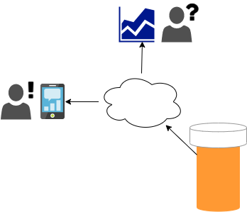
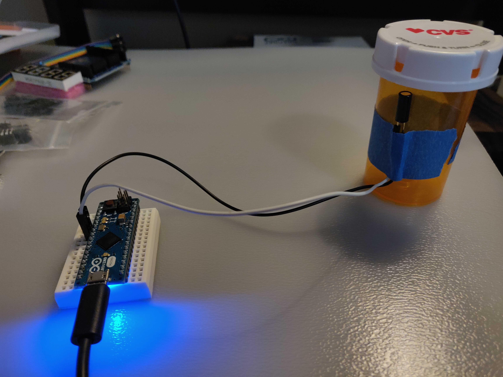

# Smart Pill Bottle

Sample Arduino / NodeJS / JohnnyFive IoT project

Concept: An Internet-connected pill bottle that reminds the user to take their routine medication.

Prototype Technology:
  - Arduino Micro
  - Tilt Switch
  - Johnny-Five NodeJS IoT framework
  - PubNub Realtime SAAS for push notifications
  - Web application

